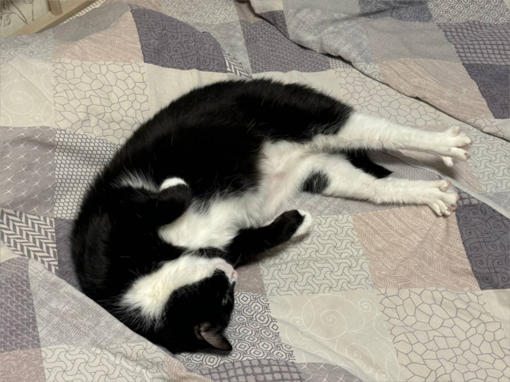
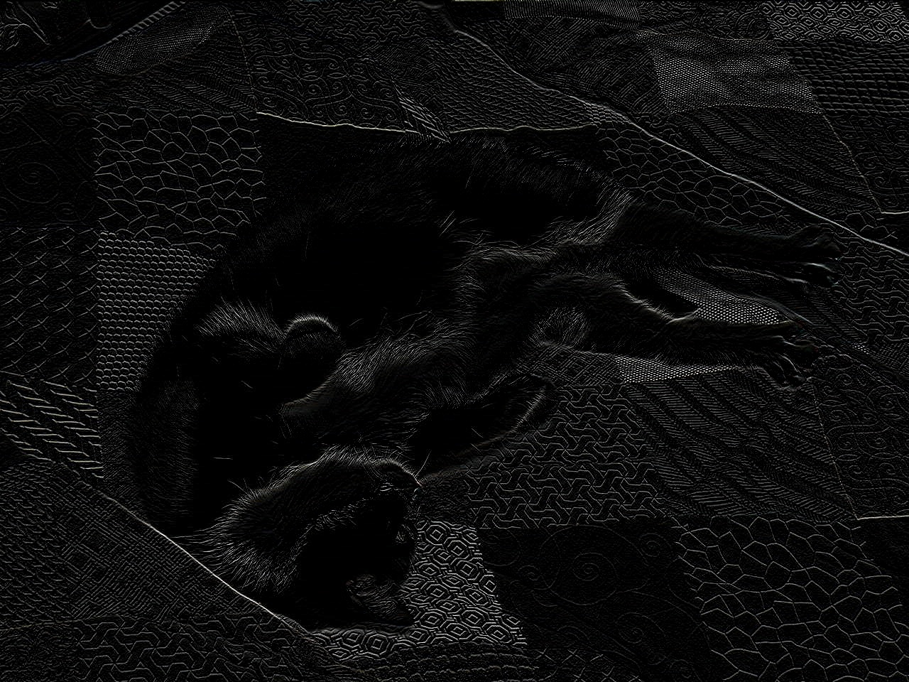
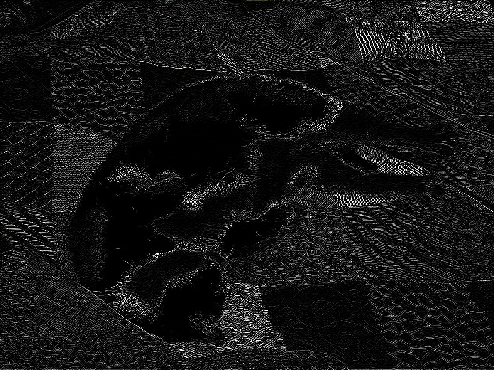
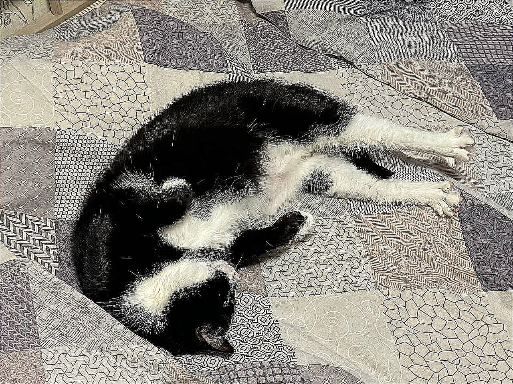
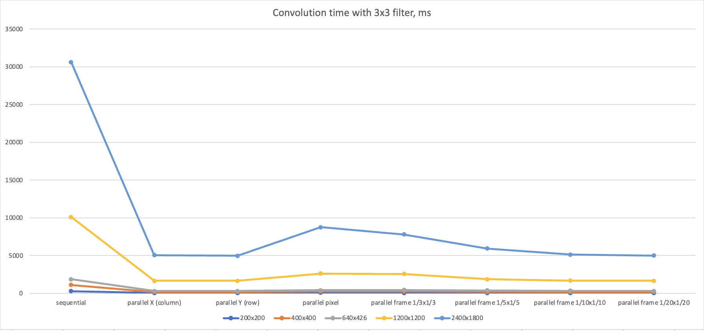

# 🐈‍⬛Kotvolution🐈‍⬛

Приложение для свертки **.JPEG** изображений последовательным и четырьмя параллельными способами


## Общее описание

Приложение поддерживает обработку изображения при помощи шести фильтров:

- **ID:** 
- **Blur:** 
- **Motion:** 
- **Horizontal Edges:** 
- **Vertical Edges:** 
- **Sharpen:** 

Свертку можно произвести пятью способами:

- **Sequential** - последовательный
- **Parallel pixel-wise** - с параллельностью на уровне обсчета пикселей
- **Parallel row-wise** - с параллельностью на уровне обсчета строк изображения
- **Parallel column-wise** - с параллельностью на уровне обсчета столбцов изображения
- **Parallel via frames** - с параллельностью на уровне обсчета прямоугольников произвольного размера. При выборе этой опции можно дополнительно указать желаемый размер прямоугольника, по умолчанию выставлены значения 50x50

## Запуск

Для запуска приложения

```bash
  git clone git@github.com:p1onerka/kotvolution.git
```
```bash
  ./gradlew build
```

```bash
  ./gradlew run
```
Для запуска тестов

```bash
  ./gradlew test
```

## Эксперимент

Для сравнения вариантов произведения свертки был проведен эксперимент. Функции тестировались на пяти картинках:

- 200x200
- 400x400
- 640x426
- 1200x1200
- 2400x1800

В качестве параметров высоты и ширины прямоугольника для последней тестируемой функции были выбраны **1/3**, **1/5**, **1/10** и **1/20** от высоты и ширины картинки соответственно

Для каждого результата был посчитан доверительный интервал. Результаты эксперимента представлены в таблице ниже:

| Размер     | Sequential            | Parallel column-wise | Parallel row-wise  | Parallel pixel-wise | Frame-wise 1/3x1/3 | Frame-wise 1/5x1/5 | Frame-wise 1/10x1/10 | Frame-wise 1/20x1/20 |
|------------|------------------------|----------------------|--------------------|---------------------|--------------------|--------------------|----------------------|----------------------|
| 200x200    | 286.21 ± 1.94 ms       | 47.48 ± 3.49 ms      | 45.60 ± 3.05 ms    | 74.57 ± 9.00 ms     | 68.40 ± 3.48 ms    | 51.78 ± 2.85 ms    | 46.91 ± 3.67 ms      | 51.74 ± 3.52 ms      |
| 400x400    | 1114.91 ± 3.11 ms      | 192.39 ± 3.35 ms     | 193.32 ± 3.70 ms   | 261.73 ± 20.60 ms   | 270.23 ± 5.12 ms   | 207.99 ± 3.57 ms   | 186.75 ± 3.72 ms     | 194.42 ± 3.78 ms     |
| 640x426    | 1862.91 ± 3.89 ms      | 329.06 ± 4.26 ms     | 322.47 ± 3.74 ms   | 428.48 ± 24.70 ms   | 455.46 ± 4.22 ms   | 394.52 ± 9.84 ms   | 333.64 ± 6.49 ms     | 321.50 ± 5.83 ms     |
| 1200x1200  | 10094.47 ± 39.99 ms    | 1666.67 ± 22.91 ms   | 1650.71 ± 21.46 ms | 2611.25 ± 37.29 ms  | 2569.46 ± 7.66 ms  | 1880.23 ± 14.56 ms | 1678.31 ± 5.83 ms    | 1658.29 ± 6.45 ms    |
| 2400x1800  | 30607.05 ± 8.38 ms     | 5057.99 ± 13.34 ms   | 4985.39 ± 7.35 ms  | 8772.30 ± 68.49 ms  | 7799.18 ± 19.07 ms | 5935.30 ± 12.47 ms | 5122.89 ± 13.35 ms   | 5014.07 ± 7.55 ms    |


И на графике: 

Как видно, наилучшее поведение показывает распараллеливание по рядам и по прямоугольникам, если правильно подобрать их размер.
Например, для изображения 400x400 оптимальным оказалось деление на 100 прямоугольников, попытка сделать больше приводит к увеличению времени.
На 200x200 тоже, но в этом случае деление на прямоугольники работает хуже распараллеливания по рядам.
А вот на больших изображениях чем больше прямоугольников, тем лучше получается результат

## Лицензия

Продукт распространяется под MIT лицензией (см. LICENSE)

## Контакты
* [p1onerka](https://github.com/p1onerka) (tg @p10nerka) 


